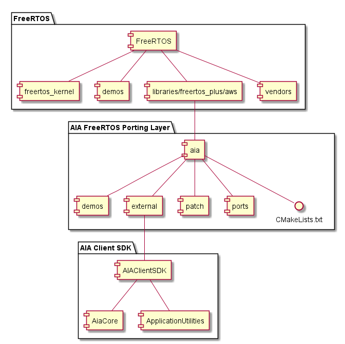

# AIA Client SDK Integration with FreeRTOS #

> This project is a port of the AIA Client SDK to FreeRTOS. AIA stands for Alexa Voice Service Integration for AWS IoT.

A complete implementation, including implementation of the porting layer on FreeRTOS, and a demo application that performs AIA registration and Alexa interactions, is provided for the Windows Simulator target of FreeRTOS.  You can use it as a template for porting to embedded hardware platforms of FreeRTOS.



## How to get the code ##

In order to build a complete executable, you will need three components, shown in the chart above.

1. **FreeRTOS**: This is the official FreeRTOS IoT Reference Integration package. You can download it from [AWS GitHub](https://github.com/aws/amazon-freertos).
2. **AIA Porting Layer**: This is the project you are looking at right now. Download this project and place it under the libraries folder of FreeRTOS. It does not contain the AIA Client SDK, but when you clone this project, Git helps to download the AIA Client SDK as a sub-module.

3. **AIA Client SDK**: The SDK implements AIA protocols and core functions.

## Get a refresh token ##

> Before you can build and run, you need to register with AVS and obtain a refresh token.

1. You need an Amazon Developer Account at <https://developer.amazon.com/>
2. Create an **AVS product ID** and **AVS client ID** by following the instruction [here](https://developer.amazon.com/en-US/docs/alexa/alexa-voice-service/code-based-linking-other-platforms.html#step1).
3. Find your **AVS product ID** and **AVS client ID** from the AVS console
   * **AVS client ID** is in AVS console → Security Profile → Other devices and platforms
4. Get **user code** and **device code** by curl
   * Replace **AVS_CLIENT_ID** and **AVS_PRODUCT_ID** in the command below
   * Define a unique ID as your device serial number, use it in place of the *YOUR_DSN*

        ```sh
        curl -k -d'response_type=device_code&client_id=AVS_CLIENT_ID&scope=alexa%3Aall&scope_data=%7B%22alexa%3Aall%22%3A%7B%22productID%22%3A%22AVS_PRODUCT_ID%22%22productInstanceAttributes%22%3A%7B%22deviceSerialNumber%22%3A%22YOUR_DSN%22%7D%7D%7D'-H"Content-Type: application/x-www-form-urlencoded"-X POST https://api.amazon.com/auth/O2/create/codepair
        ```

   * You will get **USER_CODE** and **DEVICE_CODE** from the response.

5. Sign into <https://amazon.com/us/code>, fill in the **USER_CODE** returned by previous command
6. Get **refresh token** by curl
    * Replace the **DEVICE_CODE** and **USER_CODE** in the command below
    * You will get a **REFRESH_TOKEN** from the response

        ```sh
        curl 'https://api.amazon.com/auth/O2/token' -H "Content-Type: application/x-www-form-urlencoded" -X POST -d 'grant_type=device_code&device_code=DEVICE_CODE&user_code=USER_CODE'
        ```

## How to build ##

1. Download *FreeRTOS* from [GitHub](https://github.com/aws/amazon-freertos). The latest version of this project has been integrated with version **`202007.00`**.
2. Put the content of this project under the $AFR_SRC_DIR/libraries/freertos_plus/aws/aia directory

    ```sh
    cd $AFR_SRC_DIR/libraries/freertos_plus/aws
    git clone $AIA_PORTING_LAYER_GIT_REPO_URI aia --recurse-submodules
    ```

3. The **[AIA Client SDK](https://github.com/alexa/AIAClientSDK)** is downloaded automatically under $AFR_SRC_DIR/libraries/freertos_plus/aws/aia/external/AIAClientSDK
    * If you have the AIA Client SDK in another folder, you can specify the path by using **-DAIA_CLIENT_SDK_DIR=YOUR_SDK_PATH** in CMake
4. At the current versions, there are some modifications needed in both the AIA Client SDK and FreeRTOS in order to make them work together. We are working with the SDK team and FreeRTOS team to upstream the needed changes. For now, please apply patches using the commands below.
   * Patch Freertos

        ```sh
        cd $AFR_SRC_DIR
        git apply $AFR_SRC_DIR/libraries/freertos_plus/aws/aia/patch/freertos_20200700_4e8219e0.patch
        ```

   * Patch the AIA Client SDK

        ```sh
        cd $AFR_SRC_DIR/libraries/freertos_plus/aws/aia/external/AIAClientSDK
        git apply $AFR_SRC_DIR/libraries/freertos_plus/aws/aia/patch/AiaClientSDK_0deab3e0.patch
        ```

5. Configure AWS IoT for FreeRTOS Demos
   * Fill credential information in $AFR_SRC_DIR/demos/include/aws_clientcredential.h and $AFR_SRC_DIR/demos/include/aws_clientcredential_keys.h

6. Build FreeRTOS for the selected target.
    * Config Log-In with Amazon (LWA) for registration.
      * Modify **$AFR_SRC_DIR/libraries/freertos_plus/aws/aia/demos/aia/aia_sample_app.c**
        * Fill your AWS account ID in **AIA_REG_HTTPS_AWS_ACCOUNT_ID**
        * Fill your AVS client ID in **AIA_REG_HTTPS_LWA_CLIENT_ID** *(obtained in step #3 of **Authenticate by Code-Based Linking** session above)*
        * Fill your LWA refresh token in **AIA_REG_HTTPS_LWA_REFRESH_TOKEN** *(obtained in step #6 of **Authenticate by Code-Based Linking** session) above*
      * Select to build AIA demo by editing **$AFR_SRC_DIR/vendors/pc/boards/windows/aws_demos/config_files/aws_demo_config.h**
        * Enable AIA demo by **#define CONFIG_AIA_DEMO_ENABLED**
    * Build the Windows Simulator target.
      * Prepare the requirements for build Windows simulator.
        * **CMake** for Windows
        * **Microsoft Visual Studio** 2019
        * **LLVM (clang-cl)**: You can get it from Microsoft Visual Studio installer program.
      * Follow the [tutorial](https://docs.aws.amazon.com/freertos/latest/userguide/getting_started_windows.html) to build FreeRTOS Windows simulator.
        * Please follow **Building and running the FreeRTOS demo project with CMake** session of the tutorial.
        * Because the AIA Client SDK requires C99 support, select **LLVM (clang-cl)** as the platform toolset for **afr_3rdparty_aia_core** and **afr_aia_demo_utils** projects in Microsoft Visual Studio.
        * If you have the problem of `'_serialize': intrinsic function, cannot be defined` when building **afr_defender**, please also select **LLVM (clang-cl)** as the platform toolset for **afr_defender**.
      * *(Optional)* If you want to `build microphone/speaker audio functionalities` for the demo app on Windows simulator:
        * The demo app on Windows Simulator uses **[PortAudio](http://www.portaudio.com/archives/pa_stable_v190600_20161030.tgz)** and **[Opus](https://github.com/xiph/opus)**. For embedded target platforms, those will be replaced by the Audio Common I/O interface of FreeRTOS.
        * Set a bool value **-DAIA_DEMO_AFR_AUDIO=true** in CMake entry to enable audio
          * Build static libraries for both PortAudio and Opus on your Windows platform
          * Specify include path and libraries path for CMake entry
            * **-DLIBOPUS_INCLUDE_DIR**=path_to_libopus_include_directory
            * **-DLIBOPUS_LIB_PATH**=path_to_opus.lib_that_is_built_by_you
            * **-DPORTAUDIO_INCLUDE_DIR**=path_to_portaudio_include_directory
            * **-DPORTAUDIO_LIB_PATH**=path_to_portaudio.lib_(static)_that_is_built_by_you
        * If you want to `run audio demo cases`, please un-comment **#define AIA_DEMO_AUDIO_ENABLE** in $AFR_SRC_DIR/libraries/freertos_plus/aws/aia/demos/aia/aia_sample_app.c
          * At run time, you can talk with Alexa when seeing **Start to talk** on console output.
          * The sample app runs a sequential flow to demonstrate microphone hold-to-talk.
          * The program will wait 2.5 seconds for user to start talking.
          * The program will wait 7 seconds for AVS response.
    * Build embedded targets
      * Change directory into $AFR_SRC_DIR/libraries/freertos_plus/aws/aia/ports folder and make modifications for the specific target.
        * **Button**: Current sample does not use buttons. Implement it if your target supports buttons.
        * **Clock**:This project provides an implementation that stores and prints time information.
        * **Common**: This project uses FreeRTOS ASSERT(0).
        * **Crypto**: The default implementation depends on mbedTLS.
        * **HTTP**: This project uses the HTTP library provided by FreeRTOS.
        * **include**: Configurations of AIA capabilities, buffer size, etc.
        * **IoT**: MQTT operations to communicate with AWS IoT Core. This project uses the MQTT library provided by FreeRTOS.
        * **LWA**: APIs to load and store LWA tokens. This project’s implementation keeps LWA information in global variables, change it if you have different mechanisms.
        * **Memory**: This project implements memory operations using FreeRTOS interfaces.
        * **Registration**: This project implements operation for loading registration information. Change it if you have a different mechanisms.
        * **Storage**: This project implements the storage used by AIA in DRAM.  Change it when you port to an embedded target.
      * Integrate audio functionalities
        * Integrate an OPUS audio codec your choice.
        * Implement microphone and speaker drivers for your platform.
        * Change the implementation of AIA sample app from PortAudio/Libopus to the one that uses your microphone and speaker drivers.
      * You can also read the AIA Client SDK [README](https://github.com/alexa/AIAClientSDK/blob/master/README.md) and [Porting Guide](https://github.com/alexa/AIAClientSDK/blob/master/PortingGuide.md) for more details.
